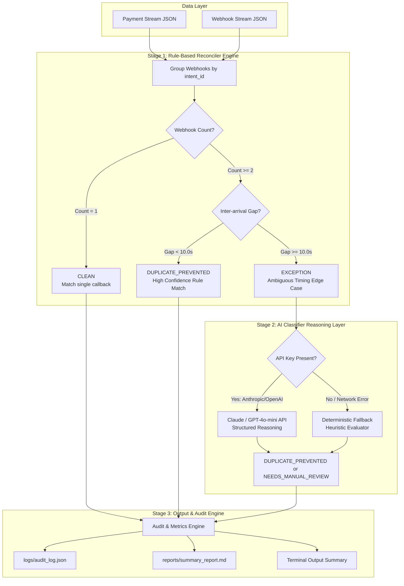

# System Architecture — Webhook Reconciliation Engine

The **Webhook Reconciliation Engine** is a high-throughput, dual-layer payment duplicate detector built for Track 04 ("AI Finance Controller").

## System Flow Diagram

## Component Architecture

1. **`data/generate_data.py`**:
   - Generates 55 synthetic intent records with precise timing distributions:
     - ~38 Normal single callbacks (0.5s–2s delay).
     - ~10 Delayed single callbacks (3s–8s network lag).
     - ~7 Duplicate/Retry events (short gap retries & ambiguous 10–15s window retries).

2. **`src/models.py`**:
   - Strongly-typed Python dataclasses (`Payment`, `Webhook`, `ReconciliationResult`) with JSON serialization.

3. **`src/reconciler.py`**:
   - Fast, deterministic rule engine evaluating inter-arrival time gaps and grouping callbacks by `intent_id`.

4. **`src/classifier.py`**:
   - AI Reasoning Layer. Evaluates complex timing edge cases using Anthropic Claude API or OpenAI GPT-4o-mini. Includes an intelligent offline fallback to guarantee deterministic execution without external API keys.

5. **`src/metrics.py`**:
   - Calculates financial loss prevented (INR), match rate percentage, total batch volume, and exception lists.

6. **`run.py`**:
   - Orchestrates the full pipeline from data ingest to markdown report generation and audit log persistence.
